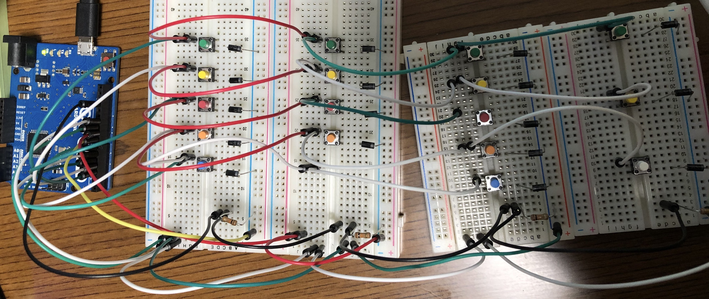
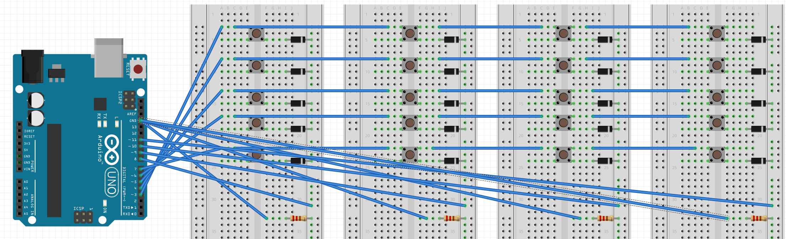

実は、[@catalyst_yuki_k](https://twitter.com/catalyst_yuki_k)と時々電子工作的なことをするというのを去年くらいからすこしずつやっている。
一時期出張とかコロナでしばらく中断していたけど、最近になって再開してみたらこれが意外と進捗して楽しかったので、やったことを忘れないうちに書いておく。[^1]

ソフトウェア系のblogとかだとやってみた的な記事ってたいていみつかるのだけど、ことハードとなるとこれが意外と見つからなくて、配線図とコードの全文が
まるっと見れるところがなかったりして、色々調べたりハマったこともあるので自分たちがやったことを忘れないようにメモしておく。

もし何かやろうという人の参考になれば非常に幸いです。

今回はおいおい自分達でキーボードとか作って行きたいということで、テンキーを作成した。

## 作ったもの

ちょっと動画では見にくいかもしれないが、こんな感じのテンキーを作った。

ゆくゆくは実際のキーボードにしたいけど、今回はプロトタイピングということで、ブレッドボードとタクトスイッチで代用している。

<blockquote class="twitter-tweet"><p lang="ja" dir="ltr">夏休みの宿題よろしくテンキー作った <a href="[https://t.co/x4Qa4FZg0R](https://t.co/x4Qa4FZg0R)">[pic.twitter.com/x4Qa4FZg0R](http://pic.twitter.com/x4Qa4FZg0R)</a></p>— nobuhikosawai (@nobuhikosawai) <a href="[https://twitter.com/nobuhikosawai/status/1314942823603400704?ref_src=twsrc^tfw](https://twitter.com/nobuhikosawai/status/1314942823603400704?ref_src=twsrc%5Etfw)">October 10, 2020</a></blockquote>

写真はこちら



## 使ったもの

- Arduino Leaonard
- ブレッドボード
- ダイオード
- 10kΩ抵抗
- タクトスイッチ

もともとは[Grove Beginner Kit](https://www.switch-science.com/catalog/6361/)にあるArduino互換のボードで作ろうと思っていたのだけど、
搭載されているArduinoがUNO互換で [どうやらUNOだとHID機能に対応していない](https://qiita.com/MergeCells/items/17bdc1c1fb35949195b5#マイコンボードを選ぶ際の注意点)ようだったので、Arduino Lenoardに変更した。

## やったこと

キーマトリックスを実装した。

キーマトリックスは少ないマイコンでキーボードみたいな入出力の多いデバイスを実現するための方法である。

キーボードをナイーブに1つの入出力に対してマイコン1つみたいな組み方をしてしまうと、キーの数だけマイコンが必要になってしまう。
それではキー増えるたびにどんどんマイコンが必要になってしまうので、[こちらの図](https://synapse.kyoto/lib/ResKeypad/page001.html#index1)にあるように、キーごとに入出力に使うピンの組み合わせを変えておくことで、少ないマイコンで多くのキーの入力を読み取っていくという方式になっている。

キーマトリックスの注意点として、同時押しをした場合に意図しないキーの入力が検出されることがある。それを解決するために、意図しない方向へ電流が流れるのを防ぐため、
整流ダイオードをつける必要がある。整流ダイオードには電流を一方向にしか流さない性質がある。

このあたりの説明については[こちらの記事](https://romly.com/archives/2017/10/arduino_key_matrix.html)がわかりやすい。

### 配線

実際に作成した配線はこちら。

配線図は[fritzing](https://fritzing.org)で作成した。OSSなので公式のページの他、[Github](https://github.com/fritzing/fritzing-app)からも入手が可能。



### プログラム

今回作成したArduinoで動作させるコードは以下のとおり。

```cpp
#include "Keyboard.h"

const int rowNum = 5;
const int colNum = 4;

const int rowPin[rowNum] = { 3,4,5,6,7 };
const int colPin[colNum] = { 8,9,10,11 };
const byte keyMap[rowNum][colNum]  = {
  { 83+136, 84+136, 85+136, 86+136},//num /   *   -
  { 95+136, 96+136, 97+136, 87+136},//7   8   9   +
  { 92+136, 93+136, 94+136, 0x00},//4   5   6   N/A
  { 89+136, 90+136, 91+136, 88+136},//1   2   3   enter
  { 98+136, 0x00, 99+136, 0x00},//0   N/A .   N/A
};

bool currentState[rowNum][colNum];
bool beforeState[rowNum][colNum];

int i,j;

void setup() {

  for( i = 0; i < rowNum; i++){
    pinMode(rowPin[i],OUTPUT);
  }

  for( i = 0; i < colNum; i++){
    pinMode(colPin[i],INPUT);
  }

  for( i = 0; i < rowNum; i++){
    for( j = 0; j < colNum; j++){
      currentState[i][j] = LOW;
      beforeState[i][j] = LOW;
    }
    digitalWrite(rowPin[i],LOW);
  }

  Serial.begin(9600);
  Keyboard.begin();
}

void loop() {
  for( i = 0; i < rowNum; i++){
    digitalWrite( rowPin[i], HIGH );

    for( j = 0; j < colNum; j++){
      currentState[i][j] = digitalRead(colPin[j]);

      if ( currentState[i][j] != beforeState[i][j] ){

        Serial.print("key(");
        Serial.print(i);
        Serial.print(",");
        Serial.print(j);
        Serial.print(")");

        if ( currentState[i][j] == HIGH){
          Serial.println(" Push!");
          Keyboard.press( keyMap[i][j] );
        } else {
          Serial.println(" Release!");
          Keyboard.release( keyMap[i][j] );
        }
      beforeState[i][j] = currentState[i][j];
      }
    }
    digitalWrite( rowPin[i], LOW);
  }
}
```

## 苦労したこと
### チャタリング

いくつかのサイトを見て組んでいったのだけど、最初に組んだときは入力していないのに勝手にキーボードからキーが入力されるという現象が発生した。

実際に作った作例がまるっとのっているものがなかったのと、特に抵抗まわりを詳しく書いてるのがなくて、きちんと抵抗を付けていなかったせいで
チャタリングを起こしていたのが原因だった。

正しくプルダウン抵抗を接続した結果、チャタリングが起きなくなった。

あとで[こちら](http://eucalyn.hatenadiary.jp/entry/original-keyboard-08)で知ったのだが、Arduinoは内蔵のプルアップ抵抗があるらしく、最初からそれをつかうと自分たちで抵抗を設置する必要がなくもっとシンプルにできたみたいだった。
([プルダウン抵抗はないみたいです。](https://github.com/esp8266/Arduino/issues/478))

### USB HID Usage ID

プログラムに使うキーコードだが、ASCIIと書いてあるところもあったのだが、実際に試して見ると意図したとおりに入力できない文字があった。

また、テンキーだとNumLockみたいな文字に存在しないコードや、NumLockによる挙動の切り替えみたいなものもあって、それらを取り扱える必要がある。

実際には、[USB HID Usage ID](https://bsakatu.net/doc/usb-hid-to-scancode)で入力する必要があるようで、それに修正すると正しく動いた。

注意としてArduinoでUSB HID Usage IDで取り扱うには136を足す必要がある。

参考:
- https://forum.arduino.cc/index.php?topic=179548.0
- https://forum.arduino.cc/index.php?topic=315324.0

## 最後に

後日談としてここで作成したテンキーをもとにArduino用のシールドの基盤を書いて、[Fusion PCB](https://www.fusionpcb.jp/fusion_pcb.html)に発注してみた。

続編でそのあたりの話も書いてみたいと思う。

## 参考にしたサイト
- [1から自作キーボードを作ってみた](https://qiita.com/kamaboko123/items/c32ad91434ffc7f4ff8d)
- [オリジナルキーボードを作ってみる その7「キーマトリックス」](http://eucalyn.hatenadiary.jp/entry/original-keyboard-07)


[^1]: 一緒にやってると言いつつハードは周りは友人のほうが詳しくて僕は初心者なので、おんぶにだっこで教えてもらってるみたいな感じだったりもします。
