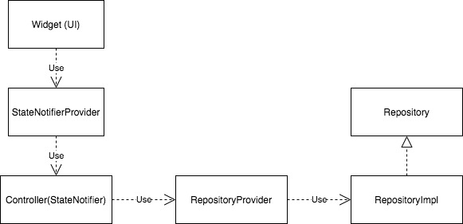

import AppVideo from './todo_app_example.mp4'
import LoginVideo from './todo_app_login.mp4'

# はじめに

この記事はこの 2, 3ヶ月ほど、お手伝いなどで Flutter のアプリ開発を行う機会があったのですが、その際に調べたり考えたりしたことをまとめたものです。
Flutter は公式ドキュメントが充実しているものの、実際に実装してみると意外と細かくハマったり、実装上で考えることがあるので、今回自分が実装したことの範囲で、そのあたりのことをまとめてみました。何かの参考になれば非常にありがたいですし、本格的なFlutterのアプリを実装するのは今回が初めてなので間違っていることや改善点があればまさかりを投げていただけると嬉しいです。

主に以下のようなことについてまとめていく予定です。

- 採用したアーキテクチャと状態管理の方法
- Navigator2.0を用いた画面遷移の実装
- ネイティブのコードの呼び出し方
- その他開発時のtips/実装時にハマったことなど

以下は直接掘り下げることができていないので、別の機会に触れようと思います。

- 自動テスト
- ビルド・配信周り

長くなりそうなので、いくつかに分けて書いていこうと思います。今回は採用したアーキテクチャと状態管理手法についてまとめます。

# アプリの概要

実際のコードがあったほうがわかりやすいと思うので、今回得た知見をもとにTODOアプリを作ってみました。

アプリのコードはこちらです。 https://github.com/nobuhikosawai/flutter_todo


以下のようなアプリでユーザーの認証とTODOのCRUDを機能として持っています。認証とデータの永続化のバックエンドにはFirebaseを使っています。

<video autoPlay loop playsinline>
   <source src={AppVideo} type="video/mp4" />
   <p>todoの操作</p>
</video>

<video autoPlay loop playsinline>
   <source src={LoginVideo} type="video/mp4" />
   <p>loginの操作</p>
</video>

# アーキテクチャの概要

基本的にはクリーンアーキテクチャをベースにアプリの複雑さに対してアーキテクチャが複雑になりすぎないように少し改変しています。

クリーンアーキテクチャについては以下の記事などを参考にしてください

- [クリーンアーキテクチャ(The Clean Architecture翻訳)](https://blog.tai2.net/the_clean_architecture.html)
- [実装クリーンアーキテクチャ](https://qiita.com/nrslib/items/a5f902c4defc83bd46b8)
- [Getting Started for Clean Architecture](https://github.com/neonankiti/CleanArchitectureSample/wiki/Getting-Started-for-Clean-Architecture)

今回の設計ではは大きくはdata fetchingレイヤーとpresentationalレイヤーの2つに分割しています。

## data fetching レイヤー

クリーンアーキテクチャのinterface adapter相当のレイヤーです。RepositoryとEntityを格納しています。 
Repositoryはインターフェースと実装を分離して実際に使うクラスDIするようにしています。

## presentational レイヤー

ユーザーから実際に見える画面に関する責務を持つレイヤーです。ViewやControllerが該当します。

Flutterでの状態管理のライブラリの選定については[こちらの記事](https://medium.com/flutter-jp/state-1daa7fd66b94)を参考にしています。

ライブラリ的には

- [Riverpod](https://riverpod.dev/)
- [Flutter Hooks](https://github.com/rrousselGit/flutter_hooks)
- [StateNotifier](https://github.com/rrousselGit/state_notifier)
- [Freezed](https://github.com/rrousselGit/freezed)

を利用しています。

上記のライブラリの使い方は色々なパターンがあると思うのですが、自分がReactの経験があることもあり、割とhooksを多用し、あまりViewModel的なレイヤーを配置せずuseProviderとuseStateを細かく使うようにしています。このあたりは、[React Hooksのドキュメント](https://ja.reactjs.org/docs/hooks-faq.html#should-i-use-one-or-many-state-variables)なども参考にしています。

(当然ですがReactとFlutterは異なるものなので、これが最適なのかやパフォーマンス的な問題を引き起こさないかについては、まだ自分の理解が足りていないところがあります。)

今回のアプリでどのように使っているかは後ほど説明します。

# ディレクトリ構成

lib 以下のディレクトリ構成を示します。

```
   lib
   ├── data # クリーンアーキテクチャのdata featchingレイヤー (interface adapter)
   │   ├── datastores # repositoryの実装
   │   ├── entities # ドメインモデル
   │   ├── providers # DIコンテナ
   │   └── repositories # repositoryのinterface
   └── ui # クリーンアーキテクチャのpresentationalレイヤー
       ├── controllers
       └── screens # 画面
           ├── sign_in_screen # ログインページ
           ├── splash_screen # スプラッシュ画面
           └── todo_screen # メイン画面
```

それぞれの概要は以下の通りです。

## data ディレクトリ

### repositories

API呼び出しなどアプリの外部にあるリソースへのアクセス方法のインターフェース定義です。
あくまでインターフェース定義だけで実装はここにはありません。

これは特にモバイルアプリだと firestore などのリモートからのデータ取得とローカルキャッシュからのデータ取得が発生したりすることがあるためで、実装とインターフェースを区別にしています。

慣習的に命名規則として Repository というsuffixをつけることが多いようなので、これを踏襲しています。

### datastores

repositoriesで定義されたインタフェースに沿う実際の実装が書かれています。

先述の通り1つのインターフェースに紐付いてローカルとリモートのように複数のdatastoreの実装が存在することもありえます。(firebaseを使っているとライブラリ側でローカルとリモートの扱いを吸収してくれるので、今回例として作成したtodoアプリではそこまで複雑な実装はしていないです。)

命名規則として RepositoryImpl というsuffixをつけています。

### providers

他のクラスがレポジトリを使用する際に具体的にどのクラスを使用するかの依存関係を注入してます。RiverpodのProviderを使ってDIしています。

### entities

ドメインモデルが格納されます。レポジトリはリソースを返すのでここで定義されているモデルが返ります。
アプリの状態をイミュータブルにするために Freezed を使っています。

## ui ディレクトリ

### controllers

ユースケース相当のレイヤーです。画面から呼び出す状態の定義と変更のためのロジックを記述します。実装にはStateNotifier を使っています。

命名規則としてControllerというsuffixをつけています。

### screens

ユーザーに描画される画面(Widget)が格納されています。

1 つの画面内部で複数の Widget を持つことがあるため、ルーティングをもつ画面ごとにディレクトリを切り、その中に複数の Widget を格納するようにしています。

命名規則としては、ディレクトリが `${page_name}_screen` になっており、特にルーティングに紐づくような画面は同名で保存しています(`${page_name}_screen/${page_name}_screen.dart` の形式で格納されています。 例えば`lib/ui/screen/todo_screen/todo_screen.dart`のような形式です)それ以外のWidgetについては特に命名のルールは定めていません。

### common

アプリ内で共通で使う汎用的なUIコンポーネントがあれば別途専用のディレクトリを定義してもよい良いと考えています。

todoアプリの例ではそこまで必要なかったので作成はしていません。

# 依存の順序

上記をもとに実装の依存の順番まとめたものが以下です。



UI Widet は StateNotifierProvider を経由して、Controller(StateNotifier)に依存し、StateNotifier は RepositoryProvider 経由で Repository に依存します。

# 実装例

ここからは上記の設計方針に基づいて、Todoアプリの例で実際にどのように実装しているかを見ていきたいと思います。

メインの画面であるTodoの画面を例に今回作成したアプリがどのように実装しているかについて説明します。

## Data fetching

データ取得側のレイヤーについてまとめます。先述の通り、レポジトリパターンを採用しています。

この例ではTodoを取得します。

Todo取得のために必要なレポジトリは `TodoRepository` で定義されています。

```dart
import '../entities/todo.dart';
import '../entities/todos.dart';

abstract class TodoRepository {
  Stream<Todos> listTodos({required String meId});

  Future<Todo> createTodo(
      {required String meId,
      required String title,
      required double position});

  Future<void> updateTodo(
      {required String id, String? title, bool? completed, double? position});

  Future<void> deleteTodo({required String id});
}
```

レポジトリは取得したリソースとしてentityのインスタンスを返します。entityは別で `Todo`と`Todos`として定義されています。単一のTodoモデルと配列を扱うファーストクラスコレクションとしてのTodosモデルの2つを定義しています。immutableになるようにFreezedを用いています。entityは以下のように定義されています。

```dart
import 'package:freezed_annotation/freezed_annotation.dart';
import 'package:flutter/foundation.dart';

part 'todo.freezed.dart';

@freezed
abstract class Todo with _$Todo {
  factory Todo({
    required String id,
    required String title,
    required bool completed,
    required double position,
    required DateTime createdAt,
    required DateTime updatedAt,
  }) = _Todo;
}
```

Todosの方はインターフェースの定義に加えて、コレクションの操作などアプリのメインとなる操作に関するビジネスロジックが含まれています。

```dart
import 'package:freezed_annotation/freezed_annotation.dart';
import 'package:flutter/foundation.dart';

import 'todo.dart';

part 'todos.freezed.dart';

@freezed
abstract class Todos implements _$Todos {
  const Todos._();

  const factory Todos({
    required List<Todo> uncompletedItems,
    required List<Todo> completedItems,
  }) = _Todos;

  Todos reorder(String id, int newIndex) {
    final newPosition = _reorderedPositionAtNewIndex(newIndex);
    final newItems = uncompletedItems.map((item) {
      if (item.id == id) {
        return item.copyWith(position: newPosition);
      } else {
        return item;
      }
    }).toList();
    newItems.sort((a, b) => b.position.compareTo(a.position));

    return copyWith(uncompletedItems: newItems);
  }

  Todos complete(String id) {
    final targetItem = uncompletedItems.firstWhere((item) => item.id == id);
    final newUncompletedItems =
        uncompletedItems.where((item) => item.id != id).toList();
    final newCompletedItems = [
      targetItem.copyWith(completed: true, position: 0),
      ...completedItems,
    ];
    return copyWith(
        uncompletedItems: newUncompletedItems,
        completedItems: newCompletedItems);
  }

  Todos uncomplete(String id) {
    final targetItem = completedItems.firstWhere((item) => item.id == id);
    final newCompletedItems =
        completedItems.where((item) => item.id != id).toList();
    final newUncompletedItems = [
      targetItem.copyWith(completed: false, position: newPosition()),
      ...uncompletedItems,
    ];
    return copyWith(
        uncompletedItems: newUncompletedItems,
        completedItems: newCompletedItems);
  }

  Todos update({required String id, required String title}) {
    final newItems = uncompletedItems.map((item) {
      if (item.id == id) {
        return item.copyWith(title: title);
      } else {
        return item;
      }
    }).toList();

    return copyWith(uncompletedItems: newItems);
  }

  Todos delete(String id) {
    final newUncompletedItems =
        uncompletedItems.where((item) => item.id != id).toList();
    final newCompletedItems =
        completedItems.where((item) => item.id != id).toList();
    return copyWith(
        uncompletedItems: newUncompletedItems,
        completedItems: newCompletedItems);
  }

  double newPosition() {
     ...
  }
  
  double _reorderedPositionAtNewIndex(int newIndex) {
     ...
  }
}

```

レポジトリの実装は別途 `TodoRepositoryImpl`として定義されています。

```dart
import 'package:cloud_firestore/cloud_firestore.dart';
import 'package:flutter/foundation.dart';

import '../entities/todo.dart';
import '../entities/todos.dart';
import '../repositories/todo_repository.dart';

class TodoRepositoryImpl extends TodoRepository {
  TodoRepositoryImpl() {
    _firestore = FirebaseFirestore.instance;
  }

  late FirebaseFirestore _firestore;

  @override
  Stream<Todos> listTodos({required String meId}) {
    return _firestore
        .collection('todos')
        .where('auth_id', isEqualTo: meId)
        .orderBy('position', descending: true)
        .snapshots()
        .asyncExpand<Todos>((event) async* {
      final todoList = event.docs.map((d) {
        return Todo(
          id: d.id,
          title: d['title'] as String,
          completed: d['completed'] as bool,
          position: (d['position'] as num).toDouble(),
          // This is a workaround because updatedAt is changed by updateTodo method with
          // ServerTimestamp, updateAt can be null during update.
          // There is a way to use serverTimestampBehavior of SnapshotOptions for
          // other platform such as iOS and android so this should be fix to flutter
          // any time soon. Meanwhile the workaround is used.
          createdAt: d['created_at'] == null
              ? DateTime.now()
              : (d['created_at'] as Timestamp).toDate(),
          updatedAt: d['updated_at'] == null
              ? DateTime.now()
              : (d['updated_at'] as Timestamp).toDate(),
        );
      }).toList();

      final uncompletedItems =
          todoList.where((item) => !item.completed).toList();
      final completedItems = todoList.where((item) => item.completed).toList();

      completedItems.sort((a, b) => b.updatedAt.compareTo(a.updatedAt));

      yield Todos(
          uncompletedItems: uncompletedItems, completedItems: completedItems);
    });
  }

  @override
  Future<Todo> createTodo(
      {required String meId,
      required String title,
      required double position}) async {
    ...
  }

  @override
  Future<void> updateTodo(
      {required String id,
      String? title,
      bool? completed,
      double? position}) async {
    ...
  }

  @override
  Future<void> deleteTodo({required String id}) async {
    await _firestore.collection('todos').doc(id).delete();
  }
}
```

定義したRepositoryの受け渡しにはProviderを使ってDIをしています。Providerの実装は`todoRepositoryProvider`として定義されており、以下のような実装になっています。

```dart
import 'package:riverpod/riverpod.dart';

import '../datastores/todo_repository_impl.dart';

final todoRepositoryProvider = Provider((ref) => TodoRepositoryImpl());
```

## UI

マップのメインの画面は`TodoScreen`として定義されています。

マップから参照するTodoの状態はアプリケーションの状態として、StateNotifierで管理しています。Widgetとの状態の受け渡しにはRiverodのStateNotifierProvider経由で渡し、Widget側はFlutter HooksのuseProviderを利用して取り出しています。

具体的に見たほうがわかりやすいので、順番に見ていきたいと思います。

まずメインのTodoScreenです。Flutter Hooksを使用するためにHookWidgetを継承しています。

useProviderがWidgetで状態を取得している箇所です。

```dart
class TodoScreen extends HookWidget {
  @override
  Widget build(BuildContext context) {
    final me = useProvider(meProvider);
    final meId = me.data?.value?.id;

    if (meId == null) {
      return Container();
    }

    final todos = useProvider(todoProvider(meId));
    final todoController = useProvider(todoProvider(meId).notifier);

		...
  }
}
```

画面にはStateNotifier定義されたtodoのstateがtodoProviderというので渡ってきています。

todoProviderの定義は以下のとおりです。

```dart
final todoProvider = StateNotifierProvider.family<TodoController, AsyncValue<Todos>, String>(
    (ref, meId) => TodoController(ref, meId: meId));
```

StateNotifierProviderはStateNotifierで管理されている状態の変更をWidgetに通知するための仕組みです。
StateNotifierProiderについては公式のドキュメントの他に[こちらの記事](https://itome.team/blog/2020/05/flutter-state-notifier-provider)もわかりやすいです。

stateを返すController(StateNotifier)側の実装は以下のようなイメージです。
状態の取得と更新に関するメソッドが定義されています。

```dart
import 'package:riverpod/riverpod.dart';
import 'package:state_notifier/state_notifier.dart';

import '../../data/entities/todos.dart';
import '../../data/providers/todo_repository_provider.dart';
import '../../data/repositories/todo_repository.dart';

class TodoController extends StateNotifier<AsyncValue<Todos>> {
  TodoController(this._reference, {required this.meId})
      : super(AsyncValue.loading()) {
    _listTodos();
  }

  late TodoRepository _repository;

  final String meId;

  final ProviderReference _reference;

  void _listTodos() {
    _repository = _reference.read(todoRepositoryProvider);
    _repository.listTodos(meId: meId).listen((todos) {
      state = AsyncValue.data(todos);
    });
  }

  Future<void> createTodo(String title) async {
    _repository = _reference.read(todoRepositoryProvider);
    final position = state.data!.value.newPosition();
    await _repository.createTodo(meId: meId, title: title, position: position);
  }

  Future<void> updateOrder(String id, int newIndex) async {
    _repository = _reference.read(todoRepositoryProvider);
    final newState = state.data!.value.reorder(id, newIndex);
    state = AsyncValue.data(newState);
    final position =
        newState.uncompletedItems.firstWhere((item) => item.id == id).position;
    await _repository.updateTodo(id: id, position: position);
  }

  Future<void> completeTodo(String id) async {
    _repository = _reference.read(todoRepositoryProvider);
    final newState = state.data!.value.complete(id);
    state = AsyncValue.data(newState);
    final completedTodo =
        newState.completedItems.firstWhere((item) => item.id == id);
    await _repository.updateTodo(
        id: id,
        completed: completedTodo.completed,
        position: completedTodo.position);
  }

  Future<void> uncompleteTodo(String id) async {
    _repository = _reference.read(todoRepositoryProvider);
    final newState = state.data!.value.uncomplete(id);
    state = AsyncValue.data(newState);
    final uncompletedTodo =
        newState.uncompletedItems.firstWhere((item) => item.id == id);
    await _repository.updateTodo(
        id: id,
        completed: uncompletedTodo.completed,
        position: uncompletedTodo.position);
  }

  Future<void> update({required String id, required String title}) async {
    _repository = _reference.read(todoRepositoryProvider);
    final newState = state.data!.value.update(id: id, title: title);
    state = AsyncValue.data(newState);
    final newTitle =
        newState.uncompletedItems.firstWhere((item) => item.id == id).title;
    await _repository.updateTodo(id: id, title: newTitle);
  }

  Future<void> delete(String id) async {
    _repository = _reference.read(todoRepositoryProvider);
    final newState = state.data!.value.delete(id);
    state = AsyncValue.data(newState);
    await _repository.deleteTodo(id: id);
  }
}
```

StateNotifierはTodoRespositoryに依存しています。TodoRepositoryのinstanceの取得には、todoRepositoryProviderからProviderReferenceという他のProviderの内容を読む仕組みを経由して取得しています(ProviderReferenceの使用については[ドキュメント](https://pub.dev/documentation/riverpod/latest/riverpod/ProviderReference/read.html)や[このあたりのissue](https://github.com/rrousselGit/river_pod/issues/75#issuecomment-734522746)が参考になります) 。

StateNotifierからの値の取り出しはすべて、stateプロパティ経由で取り出します。そのためstateの状態を変更するメソッドはすべてvoidで、直接戻り値を使用することはありません。Riverpodの0.14.0からは、明示的にstateプロパティを指定しなくても、useProvider経由で取得するだけでstateが取得されます。([issue](https://github.com/rrousselGit/river_pod/issues/341))

非同期に取得するデータのStateNotifierの型は、Riverpodが提供している[AsyncValue]( https://pub.dev/documentation/riverpod/latest/riverpod/AsyncValue-class.html)で定義しています([参考にしたissueコメント](https://github.com/rrousselGit/river_pod/issues/240#issuecomment-742043781))。

これにより[whenメソッド](https://pub.dev/documentation/riverpod/latest/riverpod/AsyncValue/when.html)を使うことで非同期な状態がとるloading中、エラー時、data取得後のそれぞれの状態を直感的に定義できるようになる点です。以下のような感じで使えます。

```dart
return todos.when(
  loading: () => Container(),
  error: (error, stack) => Container(),
  data: (todos) {
    return Scaffold(
      body: ....
    );
);
```

また状態取得のための最初のAPI呼び出しはControllerのコストラクタ内部で行っています。これにより、呼び出し側が明示的にAPIをcallするようなメソッドを呼び出す必要がなく、知るべきことが少なくなるメリットがあります。

例えばコンストラクタ内部でAPI呼び出しをせずに以下のようなStateNotifierを定義した場合、以下のように呼び出し側で明示的に状態の取得を呼び出す必要があり、やや不自然な実装になります。(useMemoizedを使う理由はこのissue([1](https://github.com/rrousselGit/flutter_hooks/issues/119)、[2](https://github.com/rrousselGit/flutter_hooks/issues/132))で説明されています)

```dart
class TodoController extends StateNotifier<Accident> {
  AccidentController(ProviderReference ref, {@required this.meId})
      : _ref = ref,
        super(null);
  
  late TodoRepository _repository;

  final String meId;
  
  final ProviderReference _ref;

  Stream<void> fetch() async* {
    _repository = _ref.read(todoRepositoryProvider);
    yield _repository.getAccidents(meId: meId)?.listen((todos) {
      state = todos;
    });
  }
```

```dart
final todoController = useProvider(todoProvider(meId).notifier);
final todoStream = useMemoized(() => todoController.fetch(), []);
useStream(todoStream);

final todos = useProvider(todoProvider(meId));
...
```

コンストラクタ内部でAPI呼び出しをするとuseProviderで呼び出すだけでよくなるので、よりシンプルな実装になります。

```dart
// TodoControllerのコンスタラクタの中でサーバーからの取得が行われる
final accidentResult = useProvider(accidentProvider(meId));
```

画面全体の実装イメージは以下のような感じになります。

```dart
import 'package:flutter/material.dart';
import 'package:flutter_hooks/flutter_hooks.dart';
import 'package:hooks_riverpod/hooks_riverpod.dart';

import '../../controllers/me_controller.dart';
import '../../controllers/todo_controller.dart';
import 'completed_todo_item.dart';
import 'todo_input_form.dart';
import 'todo_item.dart';

class TodoScreen extends HookWidget {
  @override
  Widget build(BuildContext context) {
    final me = useProvider(meProvider);
    final meId = me.data?.value?.id;

    if (meId == null) {
      return Container();
    }

    final todos = useProvider(todoProvider(meId));
    final todoController = useProvider(todoProvider(meId).notifier);

    final displayCompleted = useState<bool>(false);

    return todos.when(
        data: (todos) {
          final uncompletedTodos = todos.uncompletedItems;
          final completedTodos = todos.completedItems;

          return GestureDetector(
              onTap: () => FocusScope.of(context).unfocus(),
              child: Scaffold(
                body: SafeArea(
                    child: Container(
                        padding: EdgeInsets.symmetric(horizontal: 16.0),
                        child: CustomScrollView(
                          slivers: [
                            SliverList(
                               ...
                            ),
                            ...
                          ],
                        ))),
                floatingActionButton: FloatingActionButton(
                  backgroundColor: Theme.of(context).primaryColor,
                  onPressed: () {
                    // ref: https://github.com/flutter/flutter/issues/18564#issuecomment-519429440
                    showModalBottomSheet<void>(
                        shape: RoundedRectangleBorder(
                          borderRadius: BorderRadius.only(
                              topLeft: Radius.circular(16.0),
                              topRight: Radius.circular(16.0)),
                        ),
                        context: context,
                        builder: (buildContext) {
                          return SingleChildScrollView(
                              child: Container(
                                  child: Wrap(
                            children: [
                              TodoInputForm(
                                  onSaved: (str) =>
                                      todoController.createTodo(str)),
                            ],
                          )));
                        });
                  },
                  child: Icon(Icons.add),
                ),
              ));
        },
        loading: () => Center(child: CircularProgressIndicator()),
        error: (error, stackTrace) {
          return Container(); // TODO: implement error page
        });
  }
}
```

# その他

App State以外の箇所でもFlutter Hooksを使っていて、画面で一時的に必要な状態は、Flutter HooksのuseStateを使っています。

上記で解説したような状態管理手法のキャッチアップには、各ライブラリの公式ドキュメントやexampleを見るのが一番参考になりました。

Hooksについてはライブラリの作者が React を参考にしているため、[React Hooksのドキュメント](https://ja.reactjs.org/docs/hooks-intro.html)を参考にするのがよいです。

また、これ以外にもアプリの設計は色んなパターンがありえてこれ以外の例だと

- [Flutter を MVVM で実装する](https://wasabeef.medium.com/flutter-%E3%82%92-mvvm-%E3%81%A7%E5%AE%9F%E8%A3%85%E3%81%99%E3%82%8B-861c5dbcc565)
- [参考にした状態管理手法の記事中サンプル](https://github.com/mono0926/wdb106-flutter)
- [Riverpodのexample](https://github.com/rrousselGit/river_pod/tree/master/examples)

などがあります。

絶対の正解はなくスタイルやアプリの規模によって適切な設計は変わってくると思うので、必要に応じてぜひこれらの例も参考にしてみてください。

次回はNavigator2.0を用いた画面遷移の実装についてまとめます。

